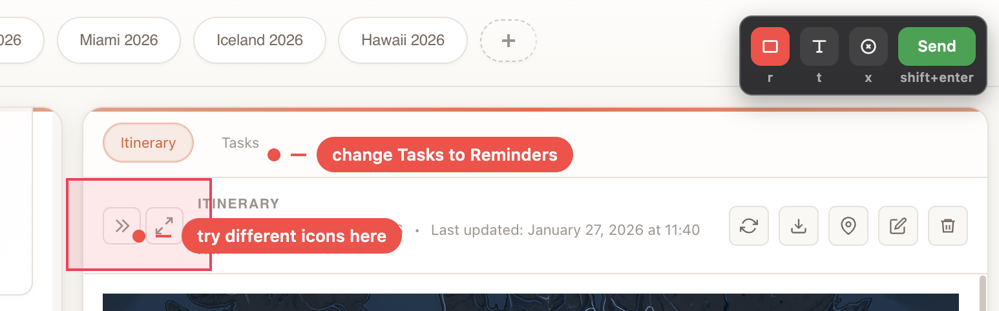

# Redline



Redline is a Chrome extension for visual UI feedback. It lets you draw boxes, add text callouts, and save an annotated screenshot to your local machine.

## What It Does

- Toggles annotation mode on the current tab.
- Draws rectangle highlights.
- Adds text callouts anchored to points on the page.
- Captures the visible tab with annotations.
- Works with the `/redline` command in your agent to pick up the latest screenshot from `~/.redline/feedback`, interpret it, and plan fixes.

## Requirements

- macOS or Linux
- Google Chrome
- Node.js 18+ (used by the native messaging host)

## Install

1. Clone this repo.
2. Load the extension as unpacked:
   - Open `chrome://extensions`
   - Enable Developer mode
   - Click **Load unpacked**
   - Select this repository directory
3. Copy the extension ID from the Redline card in `chrome://extensions`.
4. Run the installer:

```bash
./install.sh --extension-id <your_extension_id>
```

Optional: install command prompt files for both Claude and Codex (auto-detected).

```bash
./install.sh --extension-id <your_extension_id> --install-commands
```

Install behavior:
- If `~/.claude` exists, installs `~/.claude/commands/redline.md`
- If `~/.codex` exists, installs `~/.codex/prompts/redline.md`
- If either directory is missing, that install is skipped

## Usage

1. Click the Redline extension button.
2. Use toolbar controls:
   - Rectangle
   - Text
   - Clear
   - Send
3. Press **Send** to capture the full visible tab with your annotations, so the agent gets full page context.
4. Run the `/redline` command in your agent. This picks up the latest screenshot saved at `~/.redline/feedback` (`feedback-<timestamp>.png`), interprets it, and comes up with a plan to address the issues noted.

## Keyboard Shortcuts

- `r`: rectangle tool
- `t`: text tool
- `x`: clear annotations
- `Cmd+Enter`: send capture
- `Escape`: remove focused annotation, then exit annotation mode

## Development

Install dependencies:

```bash
npm ci
```

Run tests:

```bash
npm test
```

## Project Layout

- `manifest.json`: Chrome extension manifest
- `background.js`: extension service worker
- `content.js`: annotation UI logic
- `content.css`: annotation UI styles
- `native-messaging/host.js`: native messaging entry point
- `native-messaging/lib.js`: native messaging and file-writing helpers
- `install.sh`: native host installer
- `commands/redline.md`: optional command prompt template for assistant workflows
- `test/`: unit and behavior tests
